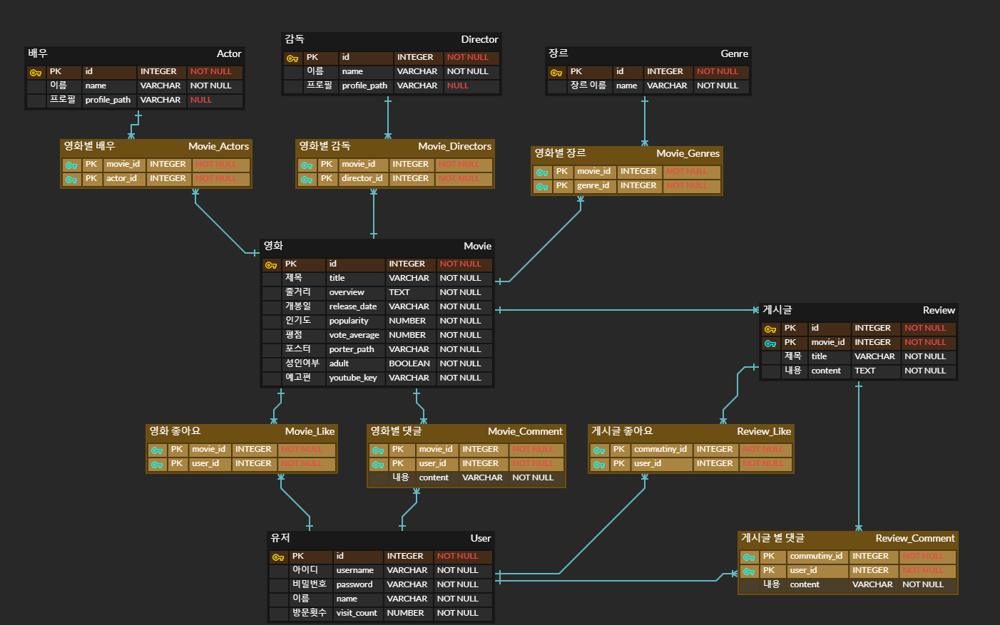

# Final Pjt 

 

## 1. 팀원 정보 및 업무 분담 내역

 

* **팀원 정보 및 업무 분담 내역**
  * 팀장 : 홍동현(Back End)
    * 각각의 페이지에 관련된 데이터 처리
    * 추천에 따른 알고리즘 구성(태양고도, 좋아요, 컬러 테스트)
    * 여러 API를 통해 데이터 수집
    * 태양고도 데이터 크롤링

  * 팀원 : 유지홍(Front End)
    * 메인 페이지, 상세 영화 페이지, 검색 페이지
    * 추천 페이지, 리뷰 게시판, 마이 페이지
    * 추가적인 검색 알고리즘 구현
    * 반응형 페이지 구현		

 

---

 

## 2. 목표 서비스 구현 및 실제 구현 정도

 

* **메인 페이지**
  * 현재 상영 순 / 평점순 / 인기순 / 최신순 / 성인 영화 / 좋아요(유저 정보 기반)으로 영화를 제공 (완료) 

 

* **상세 영화 페이지**
  * 영화에 대한 디테일 정보(제목, 장르, 내용, 평점 등등)뿐만 아니라 영상을 보여주고, 영화의 배우와 감독 정보도 제공(완료)
  * 상세 영화 페이지에서 좋아요 / 댓글 작성(완료)
  * 상세 영화 페이지에서 해당 영화에 대한 리뷰 작성 및 게시판 접근(완료)

 

* **검색 페이지**
  * 장르별, 제목별 검색이 가능(완료)
  * 페이징 보기 방식과 스크롤 보기 방식 2가지를 제공하여 사용자에 맞게 검색 가능(완료)

 

* **추천 페이지**
  * 사용자의 현 위치의 실시간 태양고도에 따른 추천(완료)
  * 좋아요를 기반으로 좋아요 상위 2개의 장르 영화 추천 및 좋아요가 가장 적은 영화 추천(완료)
  * 컬러 테스트를 통해 영화 추천(완료)

 

* **영화 리뷰 게시판**
  * 영화별 리뷰 게시판 구현(완료)
  * 리뷰 내에서 좋아요 및 댓글 작성(완료)

 

* **마이 페이지**
  * 좋아요를 한 장르를 기반으로 분석 그래프(완료)
  * 팔로우 팔로워 기능을 제공하여 해당 데이터 사용자 직접 관리 가능(완료)
  * 사용자 기반으로 좋아요, 플레이리스트 목록 제공(완료) 

 

---

 

## 3. 데이터베이스 모델링(ERD)

 

 

---

 

## 4. 필수 기능에 대한 설명

 

* **관리자 뷰**
  * admin 등록을 통해 해결하였고, 프론트에서 관리자만 admin 페이지로 접근 가능하도록 해줌

 

* **영화 정보**
  * 500개의 영화 정보를 통해 메인 페이지, 영화 상세 페이지에 맞춰서 영화 정보를 보여줌
  * 로그인을 한 유저만 영화에 대한 좋아요, 평점, 댓글 작성/수정/삭제가 가능함

 

* **영화 추천 알고리즘**
  * 태양 고도에 따른 추천
    * 사용자의 위도, 경도를 바탕으로 한국 천문 연구원 사이트를 동적 크롤링하여 실시간 태양고도 값을 가져옴.
    * 태양 고도 값으로 영화 장르를 추천하여 관련 영화를 보여줌
  * 좋아요 정보에 따른 추천
    * 사용자가 좋아요를 한 영화를 토대로 상위 2개의 장르에 해당하는 영화를 보여줌
    * 사용자의 선택 폭을 넓히기 위해 좋아요가 가장 적은 영화 장르의 연관 영화들도 제공
  * 컬러 테스트 추천
    * 흰색/검정색/빨간색/주황색/노란색/초록색/파란색/보라색의 8가지 색을 가지고 컬러 테스트를 진행하고, 색 별로 값을 매기고 최종 값을 계산함
    * 계산된 값을 토대로 영화 장르를 추천한 후, 장르에 해당하는 영화를 보여줌

 

* **커뮤니티**
  * 영화 정보를 소통할 수 있는 리뷰 게시판을 구현함.
  * 로그인 한 사용자만 이용이 가능하며, 조회 생성 뿐만 아니라 좋아요도 가능함.
  * 작성자 본인만이 글의 수정 삭제가 가능함.
  * 리뷰에 대해 댓글을 작성할 수 있으며, 작성자만 삭제 가능.
  * 리뷰와 댓글에 대해서는 DB에 생성 및 수정 시각이 저장됨

 

---

 

## 5. 배포 서버 URL

 

* X(추후에 반드시 배포할 예정..)

 

---

 

## 6. 기타(느낀점)

 

* **홍동현**
  * 지금까지 조각 조각 배웠던 내용을 하나로 합치고 일주일이라는 짧은 시간에 녹여내는 것이 한편으로는 어려우면서도 재밌는 경험이었습니다. 백엔드를 맡아서**,** 데이터의 흐름을 읽고 적절한 데이터를 보내는 과정에서 많은 고난이 있었습니다**.** 그래도 데이터를 처리, API에서 정보 받아오기, 크롤링 등등 여러 경험을 하면서 제 자신의 실력을 가늠해보고**,**  앞으로의 방향성을 생각해보게 되는 값진 경험이었습니다.

 

* **유지홍**
  * 사실상 이 프로젝트를 하기위해 싸피를 입과했다고 할 정도로 열심히 했습니다. 구현이 생각보다 어려운 부분도 많았고 너무나 힘들었지만 막상 끝나니 뿌듯하고 행복합니다. 프론트를 전담으로 맡아서 했는데 너무나 재밌는 영역인거 같고 앞으로 프론트쪽으로 진로를 잡아볼까 생각중에 있습니다. 이대로 2학기 가서 더 열심히 해야겠습니다. 싸피 항상 감사합니다.!
